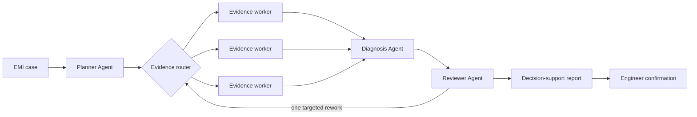
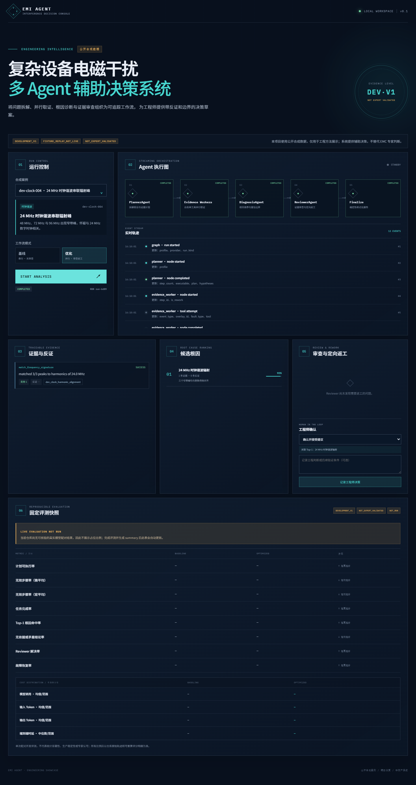
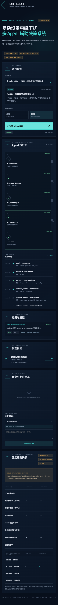

# EMI-Agent

Evidence-grounded multi-Agent decision support for synthetic electromagnetic
interference diagnosis.

> **DEVELOPMENT_V1 · SYNTHETIC DATA · NOT EXPERT VALIDATED**  
> EMI-Agent ranks candidate causes and verification actions. It does not replace
> an EMC engineer and does not claim production or real-equipment validation.

`Python` · `LangGraph` · `FastAPI` · `SQLite checkpoints` · `SSE` · `React`

## Review this repository in three minutes

| Question | Where to look | What is verifiable |
| --- | --- | --- |
| What does a run look like? | [Demo](#demo) | A single-page trace, evidence, review and engineer-decision flow |
| What changed from baseline? | [Architecture](docs/ARCHITECTURE.md) | Parallel `Send` workers, stable operation IDs, checkpoint recovery and one targeted review round |
| Did the changes improve anything, and what did they cost? | [Current evaluation snapshot](#current-evaluation-snapshot) | Raw-count paired metrics, cost distribution and Badcases |
| Can the numbers be recomputed? | [Evaluation protocol](docs/EVALUATION.md) and [canonical trajectories](artifacts/runs/full-frozen-blind-v3-20260820-canonical.jsonl) | Frozen-data boundaries, provenance gates and the 72 exported records |

For the claim boundary, data split and a concise review route, see
[showcase guide](docs/SHOWCASE.md).

## Why this project

Complex equipment diagnosis often fails for engineering reasons before it fails
for model reasons: plans contain unusable steps, parallel workers overwrite
state, retries duplicate evidence, and a fluent report hides unsupported claims.
EMI-Agent turns those failure modes into explicit, testable mechanisms:

1. hypothesis-driven planning with executable completion conditions;
2. typed shared state and parallel evidence collection;
3. checkpointed recovery with stable operation IDs;
4. independent review and targeted rework;
5. trajectory-level paired evaluation with raw evidence.

## System flow



The API executes the compiled LangGraph through `astream`; there is no manual
orchestration fallback. See [architecture details](docs/ARCHITECTURE.md).

## Demo

The single-page UI shows the active Agent DAG, live SSE trajectory, tool-backed
evidence, counter-evidence, ranked candidate causes, review issues and the final
engineer decision boundary.





The repository intentionally contains no private device data. All selectable
cases are synthetic and their evaluator-only gold records are isolated from the
runtime.

## Quick start

Requirements: Python 3.12, [uv](https://docs.astral.sh/uv/), Node.js 20+ and
[pnpm](https://pnpm.io/).

```powershell
cd backend
uv sync --locked
uv run uvicorn app.main:app --reload --port 8000
```

In a second terminal:

```powershell
cd frontend
pnpm install --frozen-lockfile
pnpm dev
```

The UI uses the API at `http://127.0.0.1:8000` in development. Fixture mode is
available for tests and UI demonstration without credentials. A live run reads
`DASHSCOPE_API_KEY` from the process environment; no target `.env` is required
or committed.

## Repository map

```text
backend/        FastAPI API, LangGraph workflow, providers and checkpoint runtime
frontend/       React/Vite single-page execution and evaluation view
evaluation/     Frozen synthetic data, evaluator, provenance gates and scorer tests
artifacts/runs/ Canonical exported trajectories used by the published snapshot
docs/           Architecture, evaluation protocol, reviewer guide and UI captures
scripts/        Local verification and synthetic-data maintenance utilities
```

## Evaluation

The frozen benchmark contains 24 cases across six synthetic EMI cause families.
Each case is paired between `baseline` and `optimized` with the same model,
tools, schemas and deterministic reporter. Twelve replay fault overlays (24
paired records) isolate retry and checkpoint behavior from model randomness.
Replay records retain a source-run link and are never labeled as live.

Published metrics always include raw numerators and denominators:

- plan executable rate and invalid-step rate;
- task completion and Top-1 cause hit rate;
- unsupported-conclusion and Reviewer resolution rates;
- deterministic recovery success;
- model calls, tokens and end-to-end latency distribution.

See the complete [evaluation protocol](docs/EVALUATION.md). Generated live
results are published only after credential preflight and full aggregation; a
fixture or replay result is never relabeled as live.

### Current evaluation snapshot

`evaluation/results/` is a complete, single-run snapshot from
`qwen3.7-plus-2026-05-26`: 48 credentialed live normal trajectories plus 24
deterministic replay fault trajectories. Its labels are
`DEVELOPMENT_V1`, `LIVE_SYNTHETIC_SINGLE_RUN`,
`DETERMINISTIC_REPLAY_FAULT_INJECTION`, and `NOT_EXPERT_VALIDATED`.

| Metric | Baseline | Optimized |
| --- | ---: | ---: |
| Plan executable rate | 18/24 | 22/24 |
| Task completion rate | 13/24 | 18/24 |
| Top-1 cause hit rate | 23/24 | 21/24 |
| Unsupported or contradicted claims | 1/56 | 0/56 |
| Fault recovery rate | 0/12 (8 triggered) | 6/12 (11 triggered) |
| Model calls | 139 total | 172 total |
| End-to-end latency | 35,382 ms mean | 41,733 ms mean |

This single-run snapshot shows a **measured development improvement with a
cost trade-off**: the optimized profile improves plan executability, task
completion, evidence-grounded claims and proven recovery, while using more
model calls and higher mean latency. It is not a statistically stable finding,
a production result, or expert validation. The blind benchmark gives every
canonical tool a hidden executable source with neutral non-gold evidence, so
plan validity is not determined by undisclosed per-case source availability.
See [summary.json](evaluation/results/summary.json) and
[badcases.md](evaluation/results/badcases.md) for recomputable details. The 72
canonical raw records are retained in
[full-frozen-blind-v3-20260820-canonical.jsonl](artifacts/runs/full-frozen-blind-v3-20260820-canonical.jsonl).

## Verification

```powershell
./scripts/verify.ps1

# Or run the main checks separately:
cd backend
uv run pytest

cd ..\frontend
pnpm lint
pnpm typecheck
pnpm build
```

Additional backend and evaluation checks cover parallel overlap, early SSE
delivery, target-only Reviewer rework, cross-instance checkpoint recovery,
model-input leakage prevention, provenance and result re-aggregation.

## Scope and safety

This showcase deliberately excludes RAG, authentication, multi-user deployment,
vector databases, arbitrary code execution, cancellation and SSE history replay.
Evidence tools are read-only and allowlisted. Unresolved critical issues produce
`needs_human_review` rather than a forced successful conclusion.

## License

[MIT](LICENSE)
