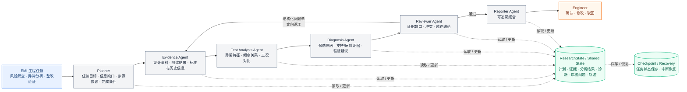
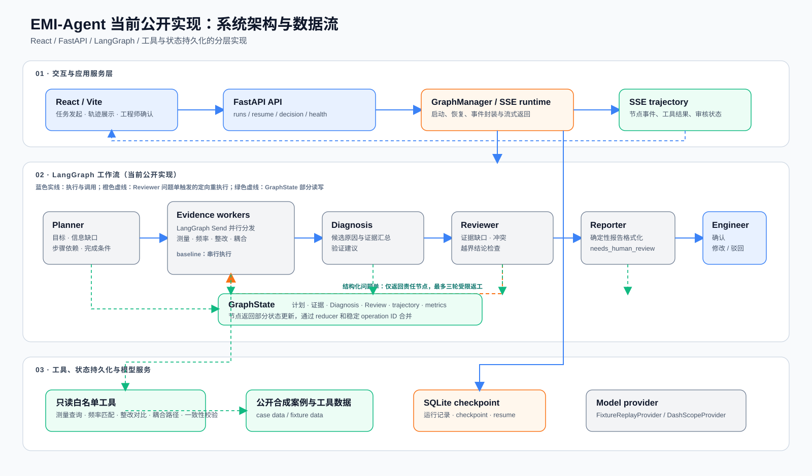

# EMI-Agent

面向复杂设备 EMI 风险筛查、测试异常分析和整改验证的多 Agent 辅助决策系统。

Multi-Agent decision support for complex-equipment EMI risk screening, test-anomaly analysis and remediation verification.

[中文](#中文) · [English](#english) · [架构](#系统架构当前公开实现) · [快速启动](#快速启动)

[](https://github.com/aristotlephil8-cell/emi-agent-showcase/actions/workflows/verify.yml)

## 中文

### 项目背景

复杂设备出现电磁干扰风险或测试异常时，工程人员需要完成从任务澄清、信息缺口识别、候选假设分析到验证方案和整改建议的一整套工作，而不是按固定步骤一次完成。

这类开放式任务同时存在信息缺失、多条分析路径和步骤依赖：新证据可能触发条件分支或动态重规划，局部问题需要定向返工，长任务中断后还需要通过检查点保留状态并恢复执行。最终输出应包含候选原因、支持与反对证据、验证建议和待确认事项，由工程师完成判断。

### 项目目标与设计主线

面对输入不完整、需要动态规划和条件路由的 EMI 分析任务，项目目标是将工程分析过程组织为可规划、可执行、可审核、可恢复、可评测的辅助决策流程，输出候选原因、支持/反对证据、信息缺口和验证建议，最终决策由 EMI 工程师完成。

方案论证中，从任务适配性、职责隔离、状态恢复和审核可控性比较后，固定流程难以覆盖任务类型、信息缺口和完成条件的差异；单一 Agent 虽能处理开放式任务，却会将规划、取证、分析、审核和报告混在同一上下文中，带来职责冲突、上下文膨胀和恢复困难。因此系统选择以 Agent 承担动态决策，再通过按职责拆分的 `Multi-Agent` 协同处理完整任务链路。

### 关键问题和优化点

| Badcase 与开发问题 | 暴露的根因 | 方案演进 |
| --- | --- | --- |
| 设计审查任务没有测试数据，流程仍调用测试分析工具；缺少工作模式或接口状态时仍生成候选原因；发现电源谐波等新线索后无法补充调查步骤 | 固定流程与隐式计划无法适应开放任务 | 结构化 `Task Planning`、计划校验、条件重规划和受控终止 |
| 规划、取证、测试分析、诊断、审核和报告都由单 Agent 完成，出现上下文膨胀、职责冲突、工具权限集中；局部工具失败或中断后容易整体重跑 | 单 Agent 难以同时处理多类职责，也无法可靠保留局部进展 | 拆分 Planner、Evidence、Test Analysis、Diagnosis、Reviewer 和 Reporter，通过 `Shared State` 协作；加入 checkpoint、稳定操作 ID、超时重试和 recovery |
| 报告结构完整，但仍可能缺少关键证据、忽略反对证据或给出越界建议 | 生成者自检无法替代独立质量控制 | 确定性预检、独立 Reviewer、问题单与定向重执行，并限制返工轮次 |
| 只看最终报告无法区分“正确规划后一次完成”和“多次绕路后勉强完成”，也难以发现修改后的回归 | 缺少对规划、工具、状态、恢复和审核全过程的可观察评测 | 记录规划、工具调用、状态变更、恢复和审核轨迹，建立固定评测、故障注入与版本回归 |

#### 最终项目设计方案与数据流

经上述迭代，系统形成由 `Task Planning`、`Evidence Collection`、`Test Analysis`、`Diagnosis`、`Review` 和 `Reporting` 组成的六角色 `Multi-Agent` 协作方案。各角色通过 `ResearchState` 交接结构化结果，`Reviewer` 以问题单驱动定向返工，checkpoint/recovery 保留中断前的任务状态。



### 系统架构（当前公开实现）

整体架构分为三层：React/Vite 负责任务输入、轨迹展示和工程师确认；FastAPI、GraphManager 与 LangGraph 负责任务编排、流式事件和状态路由；白名单工具、公开合成案例、模型 provider 与 SQLite checkpoint 提供受控的取证、推理和恢复能力。工作流从任务规划开始，经证据执行、诊断与审核后生成报告；审核发现问题时，只将相关任务定向返回处理。

<p align="center">
  
</p>

图中蓝色实线表示调用或执行顺序，蓝色虚线表示 SSE 轨迹回传，绿色虚线表示 `GraphState` 的部分读写，橙色虚线表示 Reviewer 发现问题后的定向重执行。

### 当前可用入口

| Method | Path | 用途 |
| --- | --- | --- |
| `GET` | `/api/v1/health` | 服务健康状态与 provider 可用性 |
| `GET` | `/api/v1/cases` | 读取公开合成案例目录 |
| `POST` | `/api/v1/runs/stream` | 启动 Agent 运行并通过 SSE 推送轨迹 |
| `POST` | `/api/v1/runs/{run_id}/resume/stream` | 从 SQLite checkpoint 恢复运行 |
| `GET` | `/api/v1/runs/{run_id}` | 查询运行状态、报告和轨迹 |
| `POST` | `/api/v1/runs/{run_id}/decision` | 保存工程师确认结果 |
| `GET` | `/api/v1/evaluation/summary` | 读取评测摘要接口 |

### 评测效果

在 40 个公开及合成案例的 120 次重复运行中，动态规划、协同执行、审查返工和轨迹评测等优化均带来稳定提升，具体结果如下。

| 评测维度 | 优化前 | 优化后 |
| --- | ---: | ---: |
| 计划可执行率 | 73.3% | 90.8% |
| 无效步骤率 | 17.0% | 6.6% |
| 任务完成率 | 75.8% | 89.2% |
| 故障恢复率（60 次注入） | 43.3% | 85.0% |
| 无证据支持的原子主张占比 | 20.7% | 7.5% |
| 平均分析耗时 | 14.8 分钟 | 10.9 分钟 |
| 人工修改字符占比（40 份配对报告） | 30.6% | 19.2% |

### 快速启动

要求：Python 3.12、[uv](https://docs.astral.sh/uv/)、Node.js 22.13+ 和 [pnpm](https://pnpm.io/)。

```powershell
cd backend
uv sync --locked
uv run uvicorn app.main:app --reload --port 8000
```

另一个终端启动前端：

```powershell
cd frontend
pnpm install --frozen-lockfile
pnpm dev
```

开发环境前端访问 `http://127.0.0.1:8000` API。fixture provider 不需要凭据；DashScope provider 只从当前进程读取 `DASHSCOPE_API_KEY`，不要把密钥写入仓库。

运行完整本地检查：

```powershell
./scripts/verify.ps1
```

### 范围与安全边界

当前仓库使用公开合成案例和白名单只读工具，不包含私有设备资料、认证、多用户部署、任意代码执行或自动触发真实整改。严重审核问题保留 `needs_human_review` 边界，最终 EMI 判断由工程师完成。

### 仓库结构

```text
backend/         FastAPI API、LangGraph 工作流、工具与 checkpoint runtime
frontend/        React/Vite 执行与评测界面
evaluation/      合成案例、评分器、评测测试
artifacts/runs/  运行轨迹快照
docs/            架构、评测协议与展示说明
scripts/         本地验证脚本
```

### 项目文档

- [架构说明](docs/ARCHITECTURE.md)
- [评测协议](docs/EVALUATION.md)
- [展示说明](docs/SHOWCASE.md)

### 许可证

[MIT](LICENSE)

## English

### Project background

When complex equipment shows EMI risks or test anomalies, engineers must clarify the task, identify missing information, analyse candidate causes, and propose validation and remediation actions. The workflow is open-ended: new evidence may change the path, local issues may require targeted rework, and interrupted long-running tasks must retain their progress. Final judgement remains with an EMI engineer.

### Project goal and design rationale

The project turns this process into a plannable, executable, reviewable, recoverable and evaluable decision-support workflow. It produces candidate causes, supporting and opposing evidence, information gaps and validation recommendations.

The design compared task adaptability, responsibility isolation, state recovery and review controllability. Fixed workflows cannot cover differing task goals, information gaps and completion conditions. A single Agent can make contextual decisions, but mixing planning, evidence collection, test analysis, diagnosis, review and reporting in one context creates role conflicts, context growth and recovery difficulties. The resulting design uses Agents for dynamic decisions and `Multi-Agent` collaboration for the complete workflow.

### Key problems and optimizations

| Badcase and development problem | Root cause | Evolution |
| --- | --- | --- |
| A design-review task without test data still called a test-analysis tool; missing operating-mode or interface information still led to candidate causes; new power-harmonic clues could not add investigation steps | Fixed workflows and implicit plans do not fit open-ended tasks | Structured `Task Planning`, plan validation, conditional replanning and controlled termination |
| Planning, evidence collection, test analysis, diagnosis, review and reporting were handled by one Agent, causing context growth, role conflicts and concentrated tool permissions; local failures or interruptions triggered full reruns | One Agent cannot reliably manage all responsibilities or preserve partial progress | Planner, Evidence, Test Analysis, Diagnosis, Reviewer and Reporter collaborate through `Shared State`; checkpoints, stable operation IDs, bounded retries and recovery were added |
| A well-structured report could still omit key evidence, ignore opposing evidence or make an out-of-scope recommendation | Self-review by the generator is not independent quality control | Deterministic pre-checks, an independent Reviewer, issue records, targeted re-execution and bounded review cycles |
| A final report alone cannot distinguish a direct successful plan from a detour or reveal a regression after change | The full planning, tool, state, recovery and review path was not observable | Record trajectories and establish fixed evaluation, fault injection and version regression |

#### Final project design and data flow

After these iterations, six logical Agents—Planner, Evidence, Test Analysis, Diagnosis, Reviewer and Reporter—collaborate through `ResearchState`. The Reviewer returns structured issue records for targeted rework, while checkpoint/recovery preserves task state across interruptions. The Engineer retains final authority. The Mermaid diagram in the Chinese section presents this design.

### System architecture (public implementation)

The implementation has three layers: React/Vite for task input, trajectory display and engineer confirmation; FastAPI, GraphManager and LangGraph for orchestration, streaming events and state routing; and allowlisted tools, public synthetic cases, a model provider and SQLite checkpoints for controlled evidence gathering, inference and recovery. The workflow proceeds from planning through evidence execution, diagnosis and review to reporting; review issues return only the related task for handling.

### Evaluation results

Across 40 public/synthetic cases and 120 repeated runs, the dynamic-planning, collaborative-execution, review-and-rework, and trajectory-evaluation optimizations all improved the measured outcomes.

| Metric | Before | After |
| --- | ---: | ---: |
| Plan executable rate | 73.3% | 90.8% |
| Invalid-step rate | 17.0% | 6.6% |
| Task completion rate | 75.8% | 89.2% |
| Fault recovery rate (60 injections) | 43.3% | 85.0% |
| Unsupported atomic-claim share | 20.7% | 7.5% |
| Mean analysis time | 14.8 min | 10.9 min |
| Manual-modification character share (40 paired reports) | 30.6% | 19.2% |

### Quick start

Requirements: Python 3.12, [uv](https://docs.astral.sh/uv/), Node.js 22.13+ and [pnpm](https://pnpm.io/).

```powershell
cd backend
uv sync --locked
uv run uvicorn app.main:app --reload --port 8000
```

In another terminal:

```powershell
cd frontend
pnpm install --frozen-lockfile
pnpm dev
```

Run the full local verification:

```powershell
./scripts/verify.ps1
```

Fixture mode needs no credential. The DashScope provider reads `DASHSCOPE_API_KEY` only from the current process environment; never commit secrets.

### Scope and safety

The repository uses public synthetic cases and allowlisted read-only tools. It does not include private device material, arbitrary code execution or automatic real-world remediation. Critical unresolved issues remain in `needs_human_review`, and the EMI engineer retains final authority.

### License

[MIT](LICENSE)
