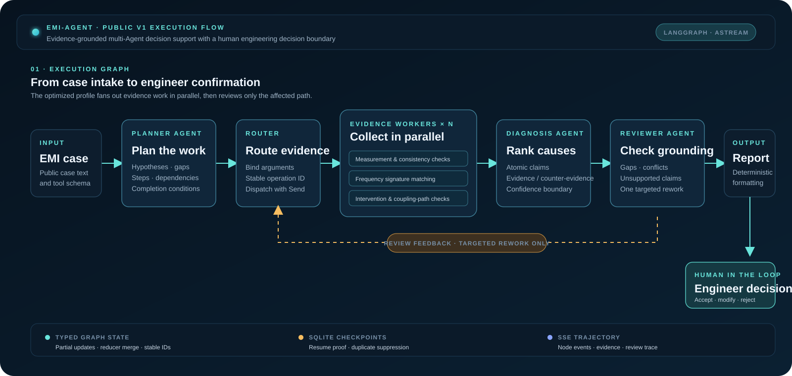

# EMI-Agent

[](https://github.com/aristotlephil8-cell/emi-agent-showcase/actions/workflows/verify.yml)

[简体中文](README.md) | [English](README.en.md)

面向复杂设备 EMI 风险筛查与异常归因的多 Agent 辅助决策系统。

> **简历项目口径 · 仅使用公开/合成数据 · 结论必须由工程师确认**
>
> 系统负责拆解工程问题、收集证据、审查冲突并生成可追溯的决策支持报告；最终 EMC 判断由工程师负责。

`Python` · `LangGraph` · `FastAPI` · `SQLite checkpoints` · `SSE` · `React`

## 个人贡献

**核心开发｜国家级科研项目子课题｜2024.10–2026.03**

1. **动态任务规划。** 基于 LangGraph 将需求拆分为目标、信息缺口、执行步骤、依赖关系与完成条件；加入计划校验、条件重规划和受控终止。
2. **Agent 编排与恢复。** 通过共享状态编排主控、证据、分析与审查 Agent，支持串行、并行和条件分支；加入 Checkpoint、幂等、超时重试与中断恢复。
3. **审查反馈与定向重执行。** 将证据缺口、证据冲突和分析错误结构化为审查反馈，只把相关 Agent 路由至返工路径，并限制重执行轮次。

## 简历评测亮点

以下项目级结果采用简历中的评测口径：**40 个公开/合成案例、120 次重复运行**。它们是本项目的主展示指标，不以仓库中较小的公开 V1 回归包替代。

| 评测维度 | 优化前 | 优化后 |
| --- | ---: | ---: |
| 计划可执行率 | 73.3% | 90.8% |
| 无效步骤率 | 17.0% | 6.6% |
| 任务完成率 | 75.8% | 89.2% |
| 故障恢复率（60 次注入） | 43.3% | 85.0% |
| 无证据支持的原子主张（每个版本标注 280 组） | 20.7% | 7.5% |

这些指标描述的是简历项目评测，不代表生产验证、真实设备部署、专家背书或自动化工程决策。

## 3 分钟了解仓库

| 问题 | 入口 | 可检查内容 |
| --- | --- | --- |
| 系统如何工作？ | [系统流程](#系统流程) | 规划、并行取证、诊断、审查与人工确认 |
| 个人具体负责什么？ | [个人贡献](#个人贡献) | 规划、带状态编排/恢复与定向审查反馈 |
| 公开 V1 的代码证据是什么？ | [公开 V1 回归证据](#公开-v1-回归证据) | 冻结数据、原始轨迹、Badcase 与严格来源标签 |
| 如何复现检查？ | [验证](#验证) | 锁定的 Python/Node 依赖与同 CI 的检查项 |

关于证据边界与面试阅读路径，参见 [展示说明](docs/SHOWCASE.md)。

## 系统流程



该图直接映射编译后的执行图：`Planner → Router → Send workers → Diagnosis → Reviewer → Reporter → Engineer`。公开 V1 通过 `astream` 执行，不存在手写编排 fallback。详见 [架构说明](docs/ARCHITECTURE.md)。

## 本地演示

React 页面会展示 Agent DAG、SSE 轨迹、工具证据与反证、候选根因、审查问题和工程师决策边界。仓库将其保留为可本地运行的演示，不宣称在线服务，也不在 README 堆叠静态截图。

## 快速启动

要求：Python 3.12、[uv](https://docs.astral.sh/uv/)、Node.js 22.13+ 与 [pnpm](https://pnpm.io/)。

```powershell
cd backend
uv sync --locked
uv run uvicorn app.main:app --reload --port 8000
```

在另一个终端中：

```powershell
cd frontend
pnpm install --frozen-lockfile
pnpm dev
```

开发环境下前端使用 `http://127.0.0.1:8000` API。fixture 模式不需要凭据，可用于测试和界面演示；真实运行只从当前进程环境读取 `DASHSCOPE_API_KEY`，不会提交目标 `.env`。

## 仓库结构

```text
backend/        FastAPI API、LangGraph 工作流、Provider 与 checkpoint 运行时
frontend/       React/Vite 单页执行与评测视图
evaluation/     冻结合成数据、评分器、来源门禁与测试
artifacts/runs/ 公开 V1 快照使用的规范化轨迹
docs/           架构、评测协议与面试阅读说明
scripts/        本地验证与合成数据维护工具
```

## 公开 V1 回归证据

仓库提交的 V1 是一套**独立且更小的工程回归协议**：24 条冻结合成案例、48 条带凭据的正常 live 轨迹，以及 24 条确定性故障回放轨迹。它验证公开工作流、来源、恢复证明与评分器契约；不被描述为对简历 40 案例/120 次运行评测的复现。

为保证轨迹契约可控，公开 V1 最多允许一轮定向返工；简历项目使用最多三轮的受限返工策略。两套协议的分子、分母和百分比不能合并。

公开 V1 工件使用 `DEVELOPMENT_V1`、`LIVE_SYNTHETIC_SINGLE_RUN`、`DETERMINISTIC_REPLAY_FAULT_INJECTION` 与 `NOT_EXPERT_VALIDATED` 标签。可继续检查 [评测协议](docs/EVALUATION.md)、[summary.json](evaluation/results/summary.json)、[Badcase 报告](evaluation/results/badcases.md) 与 [72 条规范化轨迹](artifacts/runs/full-frozen-blind-v3-20260820-canonical.jsonl)。

## 验证

```powershell
./scripts/verify.ps1
```

本地命令与 GitHub Actions 使用锁定依赖，覆盖后端测试、冻结数据校验、评分器测试、前端 contract、lint、typecheck 和生产构建。工作流不使用任何凭据，也不会调用真实模型。

## 范围与安全边界

公开展示版不包含私有设备数据、RAG、认证、多用户部署、向量数据库、任意代码执行、取消或 SSE 历史回放。证据工具均为只读白名单工具；严重问题未解决时会输出 `needs_human_review`，而不是强行给出结论。

## 许可证

[MIT](LICENSE)
