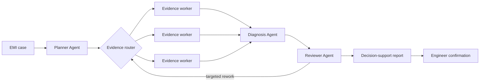

# EMI-Agent

Multi-Agent decision support for complex-equipment electromagnetic-interference
(EMI) risk screening and anomaly attribution.

> **RESUME PROJECT SCOPE · SYNTHETIC / PUBLIC DATA ONLY · HUMAN DECISION REQUIRED**
> The system decomposes an engineering question, collects evidence, reviews
> conflicts and produces a traceable decision-support report. An EMC engineer
> remains responsible for the final conclusion.

`Python` · `LangGraph` · `FastAPI` · `SQLite checkpoints` · `SSE` · `React`

## Candidate contribution

**Core developer · national research-project subtask · 2024.10–2026.03**

1. **Dynamic task planning.** Used LangGraph to turn a request into goals,
   information gaps, execution steps, dependencies and completion conditions;
   added plan validation, conditional replanning and controlled termination.
2. **Agent orchestration and recovery.** Orchestrated control, evidence,
   analysis and review Agents through shared state, serial/parallel branches and
   conditional routes; added checkpoints, idempotency, timeout retry and
   interruption recovery.
3. **Review feedback and targeted rerun.** Structured evidence gaps,
   conflicts and analysis errors as review feedback, then routed only the
   affected Agent for rerun with a bounded review cycle.

## Resume evaluation highlights

The following project-level outcomes use the candidate's résumé evaluation
scope: **40 public/synthetic cases and 120 repeated runs**. They are the
headline metrics for this project; they are not substituted with the smaller
public V1 regression bundle committed below.

| Evaluation dimension | Baseline | Optimized |
| --- | ---: | ---: |
| Plan executable rate | 73.3% | 90.8% |
| Invalid-step rate | 17.0% | 6.6% |
| Task completion rate | 75.8% | 89.2% |
| Fault recovery rate (60 injections) | 43.3% | 85.0% |
| Unsupported atomic claims (280 annotated per profile) | 20.7% | 7.5% |

These results describe the résumé project evaluation. They do not claim
production validation, real-device deployment, expert endorsement or automatic
engineering decisions.

## Review this repository in three minutes

| Question | Where to look | What is inspectable |
| --- | --- | --- |
| What does the system do? | [System flow](#system-flow) | Planner, parallel evidence collection, diagnosis, review and human confirmation |
| What did the candidate build? | [Candidate contribution](#candidate-contribution) | Planning, stateful orchestration/recovery and targeted review feedback |
| How does the public V1 behave? | [Public V1 regression evidence](#public-v1-regression-evidence) | Frozen data, raw trajectories, Badcases and strict provenance labels |
| Can I run the checks? | [Verification](#verification) | Locked Python/Node dependencies and the same local checks used by CI |

For the claim boundary, data split and a concise review route, see
[showcase guide](docs/SHOWCASE.md).

## System flow



The API executes the compiled LangGraph through `astream`; there is no manual
orchestration fallback. See [architecture details](docs/ARCHITECTURE.md).

## Local walkthrough

The React page renders the active Agent DAG, SSE trajectory, tool-backed
evidence and counter-evidence, ranked candidate causes, review issues and an
engineer decision boundary. The repository intentionally keeps this page as a
local runnable demo rather than claiming an online service or filling the
README with static screenshots.

## Quick start

Requirements: Python 3.12, [uv](https://docs.astral.sh/uv/), Node.js 22.13+ and
[pnpm](https://pnpm.io/).

```powershell
cd backend
uv sync --locked
uv run uvicorn app.main:app --reload --port 8000
```

In a second terminal:

```powershell
cd frontend
pnpm install --frozen-lockfile
pnpm dev
```

The UI uses the API at `http://127.0.0.1:8000` in development. Fixture mode is
available for tests and UI demonstration without credentials. A live run reads
`DASHSCOPE_API_KEY` from the process environment; no target `.env` is required
or committed.

## Repository map

```text
backend/        FastAPI API, LangGraph workflow, providers and checkpoint runtime
frontend/       React/Vite single-page execution and evaluation view
evaluation/     Frozen synthetic data, evaluator, provenance gates and scorer tests
artifacts/runs/ Canonical exported trajectories used by the published snapshot
docs/           Architecture, evaluation protocol and interviewer guide
scripts/        Local verification and synthetic-data maintenance utilities
```

## Public V1 regression evidence

The committed V1 bundle is a **separate, smaller engineering-regression
protocol**: 24 frozen synthetic cases, 48 credentialed live normal trajectories
and 24 deterministic replay fault trajectories. It checks the public workflow,
provenance, recovery proof and evaluator contracts; it is not presented as a
reproduction of the résumé's 40-case / 120-run evaluation.

The public V1 intentionally permits at most one targeted review rework to make
its trajectory contract deterministic. The résumé project used a bounded
multi-round policy of up to three reruns. Do not combine the metrics of these
two protocols.

Public V1 artifacts are labeled `DEVELOPMENT_V1`,
`LIVE_SYNTHETIC_SINGLE_RUN`, `DETERMINISTIC_REPLAY_FAULT_INJECTION` and
`NOT_EXPERT_VALIDATED`. The source-specific [evaluation protocol](docs/EVALUATION.md),
[summary.json](evaluation/results/summary.json), [Badcase report](evaluation/results/badcases.md)
and [72 canonical trajectories](artifacts/runs/full-frozen-blind-v3-20260820-canonical.jsonl)
remain available for code-level inspection.

## Verification

```powershell
./scripts/verify.ps1

# Or run the main checks separately:
cd backend
uv run pytest

cd ..\frontend
pnpm lint
pnpm typecheck
pnpm build
```

The local command and GitHub Actions run locked dependencies and cover backend
tests, frozen-data validation, evaluator tests, frontend contract tests, lint,
typecheck and production build. The workflow has no credentials and does not
run live model calls.

## Scope and safety

This public showcase excludes private device data, RAG, authentication,
multi-user deployment, vector databases, arbitrary code execution, cancellation
and SSE history replay. Evidence tools are read-only and allowlisted. Unresolved
critical issues produce `needs_human_review` rather than a forced conclusion.

## License

[MIT](LICENSE)
